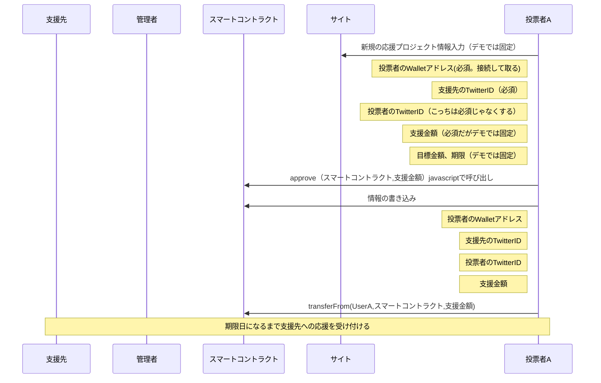
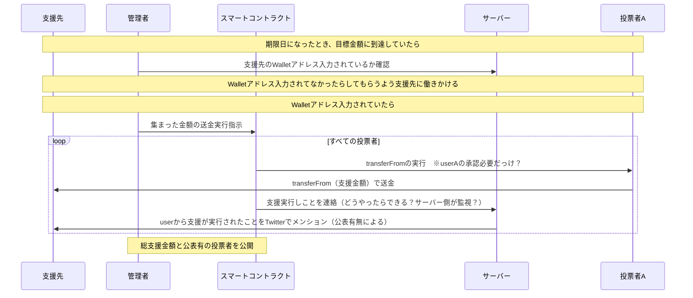
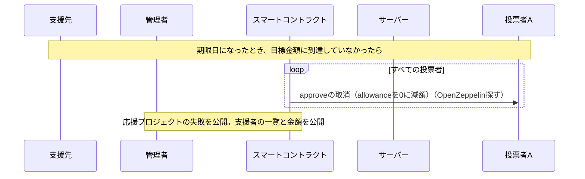

```mermaid 
sequenceDiagram
participant sp as 支援先
participant admin as 管理者
participant sc as スマートコントラクト
participant server as サイト
participant userA as 投票者A
userA->>server: 新規の応援プロジェクト情報入力（デモでは固定）
Note left of userA: 投票者のWalletアドレス(必須。接続して取る)
Note left of userA: 支援先のTwitterID（必須）
Note left of userA: 投票者のTwitterID（こっちは必須じゃなくする）
Note left of userA: 支援金額（必須だがデモでは固定）
Note left of userA: 目標金額、期限（デモでは固定）
userA->>sc: approve（スマートコントラクト,支援金額）javascriptで呼び出し
userA->>sc: 情報の書き込み
Note left of userA: 投票者のWalletアドレス
Note left of userA: 支援先のTwitterID
Note left of userA: 投票者のTwitterID
Note left of userA: 支援金額
userA->>sc: transferFrom(UserA,スマートコントラクト,支援金額)
Note over sp,userA: 期限日になるまで支援先への応援を受け付ける
```

```mermaid 
sequenceDiagram
participant sp as 支援先
participant admin as 管理者
participant sc as スマートコントラクト
participant server as サーバー
participant userA as 投票者A
Note over sp,userA: 期限日になったとき、目標金額に到達していたら
admin->>server: 支援先のWalletアドレス入力されているか確認
Note over sp,userA: Walletアドレス入力されてなかったらしてもらうよう支援先に働きかける
Note over sp,userA: Walletアドレス入力されていたら
admin->>sc : 集まった金額の送金実行指示
loop すべての投票者
   sc->>userA: transferFromの実行　※userAの承認必要だっけ？
   userA->>sp: transferFrom（支援金額）で送金
   sc->>server: 支援実行しことを連絡（どうやったらできる？サーバー側が監視？）
   server->>sp: userから支援が実行されたことをTwitterでメンション（公表有無による）
   end

Note over admin,sc: 総支援金額と公表有の投票者を公開
```

```mermaid 
sequenceDiagram
participant sp as 支援先
participant admin as 管理者
participant sc as スマートコントラクト
participant server as サーバー
participant userA as 投票者A
Note over sp,userA: 期限日になったとき、目標金額に到達していなかったら
loop すべての投票者
   sc->>userA: approveの取消（allowanceを0に減額）（OpenZeppelin探す）
   end
Note over admin,sc: 応援プロジェクトの失敗を公開。支援者の一覧と金額を公開
```