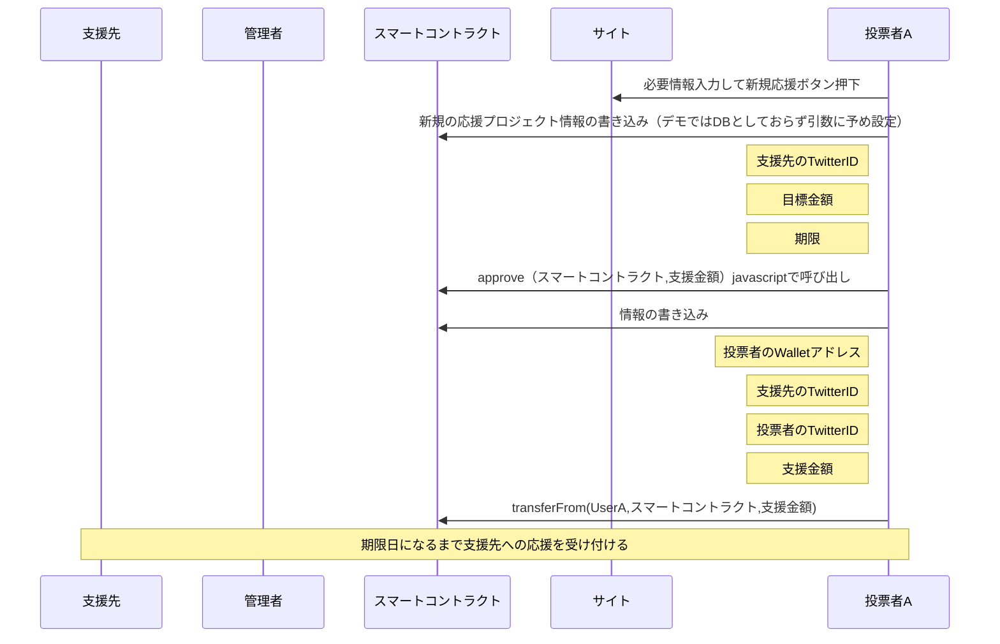
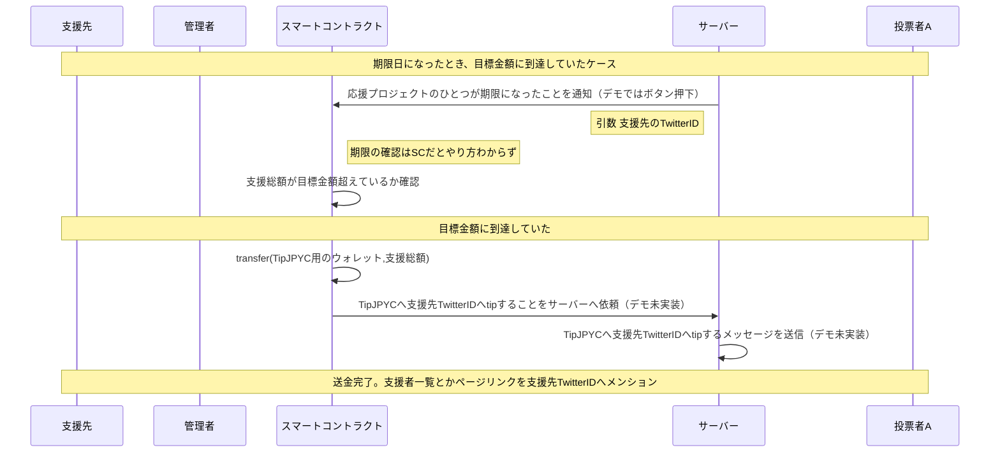
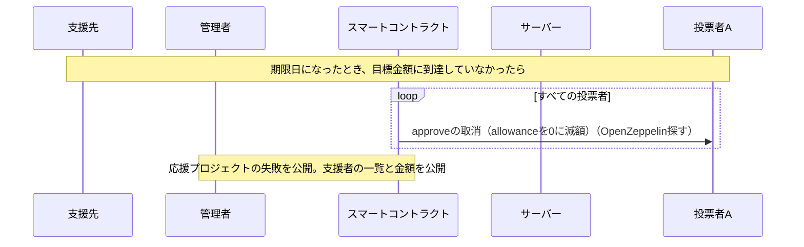

DB設計

プロジェクトごとに必要な情報
- プロジェクトID
- 目標金額
- 募集期限
- 支援先のTwitterID
- 初期支援表明者のウォレットID。
  - この人だけ金額とか期限とか編集できる。終了処理もこの人にやってもらおう
- クラウドファンディング紹介ページURL。
  - 金額に応じた特典紹介とかは外部で作ってもらう
- 終了済みフラグ
  

プロジェクトの支援金額台帳
- プロジェクトID
- 支援表明者のウォレットID
- 支援表明者のTwitterID
- 支援金額

プロジェクトIDでMappingできるはず。IDをどこで生成するか。。

■やることリスト
[ ] TwitterAPI取得
[ ] DBの変更に伴うSolidityとJavaScriptの変更。プロジェクトIDとマッピングなので結構大きい変更かも
[ ] 募集期限の到来→Solidityのプロジェクトの終了関数呼び出しをGithubPageでどうやるか？GithubPageだと無理か？
[ ] TwitterAPIでプロジェクト成功したら送信する
[ ] TwitterAPIでプロジェクトの支援者のアイコン引っ張ってくる
 
