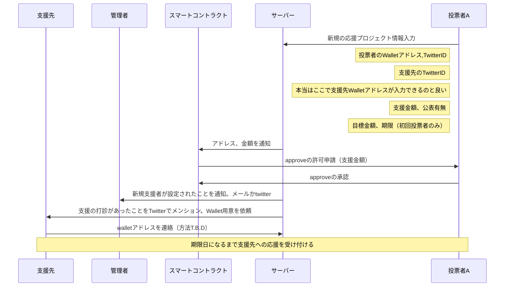
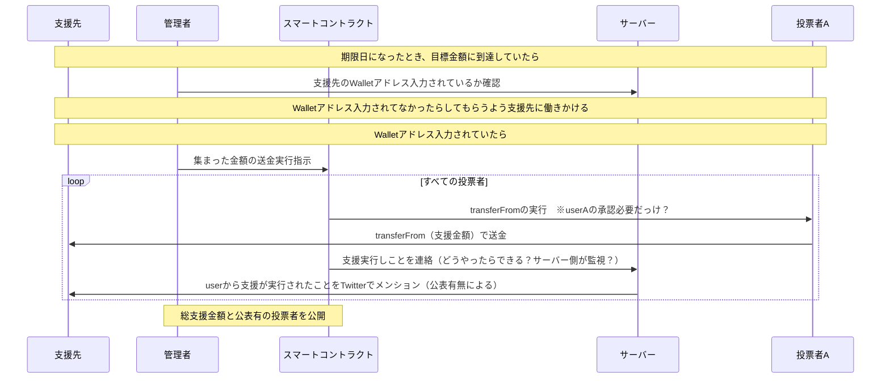
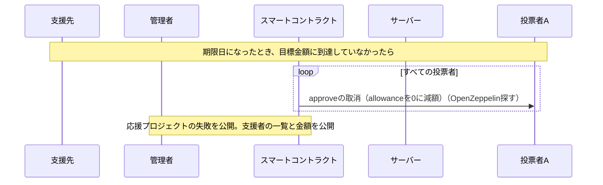

```mermaid 
sequenceDiagram
participant sp as 支援先
participant admin as 管理者
participant sc as スマートコントラクト
participant server as サーバー
participant userA as 投票者A
userA->>server: 新規の応援プロジェクト情報入力
Note left of userA: 投票者のWalletアドレス,TwitterID
Note left of userA: 支援先のTwitterID
Note left of userA: 本当はここで支援先Walletアドレスが入力できるのと良い
Note left of userA: 支援金額、公表有無
Note left of userA: 目標金額、期限（初回投票者のみ）
server->>sc: アドレス、金額を通知
sc->>userA: approveの許可申請（支援金額）
userA->>sc: approveの承認

server->>admin: 新規支援者が設定されたことを通知。メールかtwitter
server->>sp: 支援の打診があったことをTwitterでメンション。Wallet用意を依頼
sp->>server: walletアドレスを連絡（方法T.B.D）
Note over sp,userA: 期限日になるまで支援先への応援を受け付ける
```

```mermaid 
sequenceDiagram
participant sp as 支援先
participant admin as 管理者
participant sc as スマートコントラクト
participant server as サーバー
participant userA as 投票者A
Note over sp,userA: 期限日になったとき、目標金額に到達していたら
admin->>server: 支援先のWalletアドレス入力されているか確認
Note over sp,userA: Walletアドレス入力されてなかったらしてもらうよう支援先に働きかける
Note over sp,userA: Walletアドレス入力されていたら
admin->>sc : 集まった金額の送金実行指示
loop すべての投票者
   sc->>userA: transferFromの実行　※userAの承認必要だっけ？
   userA->>sp: transferFrom（支援金額）で送金
   sc->>server: 支援実行しことを連絡（どうやったらできる？サーバー側が監視？）
   server->>sp: userから支援が実行されたことをTwitterでメンション（公表有無による）
   end

Note over admin,sc: 総支援金額と公表有の投票者を公開
```

```mermaid 
sequenceDiagram
participant sp as 支援先
participant admin as 管理者
participant sc as スマートコントラクト
participant server as サーバー
participant userA as 投票者A
Note over sp,userA: 期限日になったとき、目標金額に到達していなかったら
loop すべての投票者
   sc->>userA: approveの取消（allowanceを0に減額）（OpenZeppelin探す）
   end
Note over admin,sc: 応援プロジェクトの失敗を公開。支援者の一覧と金額を公開
```